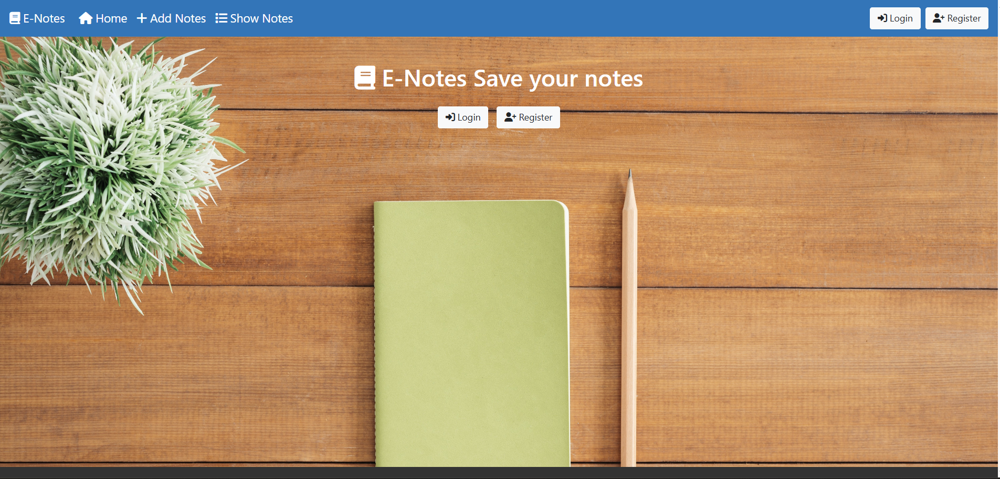
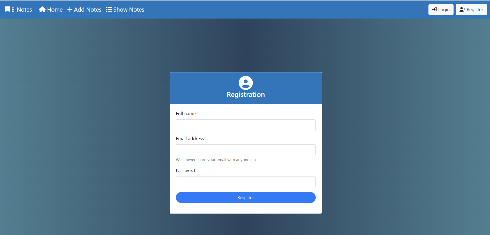
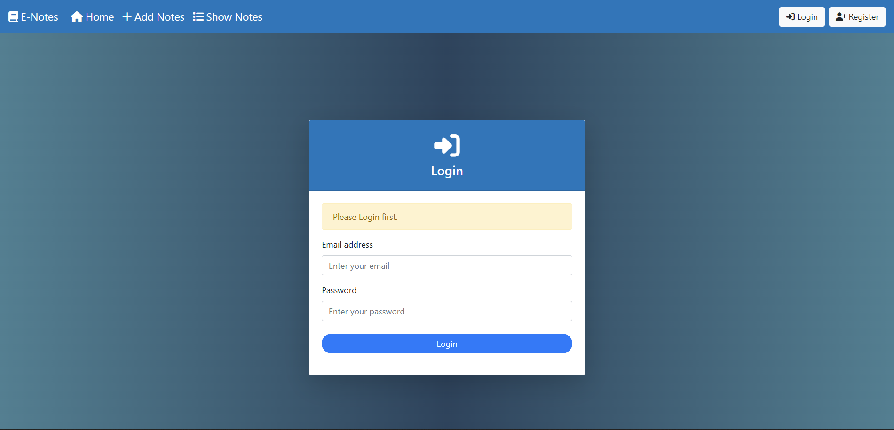
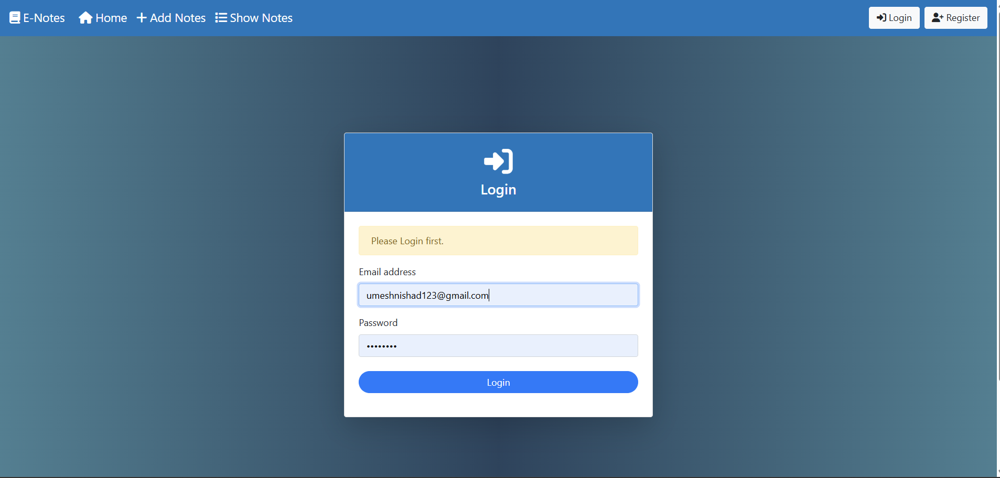
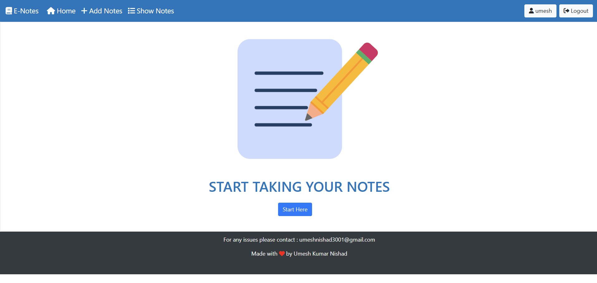
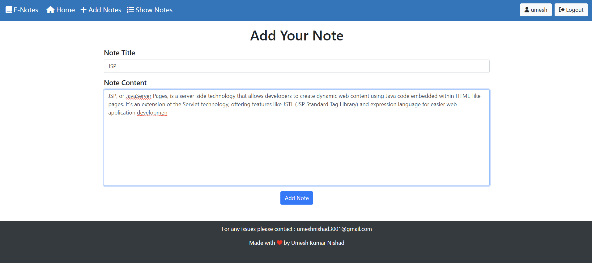
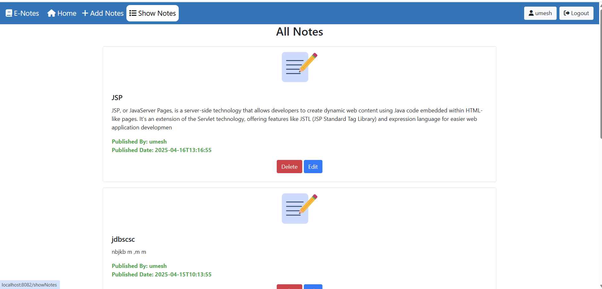
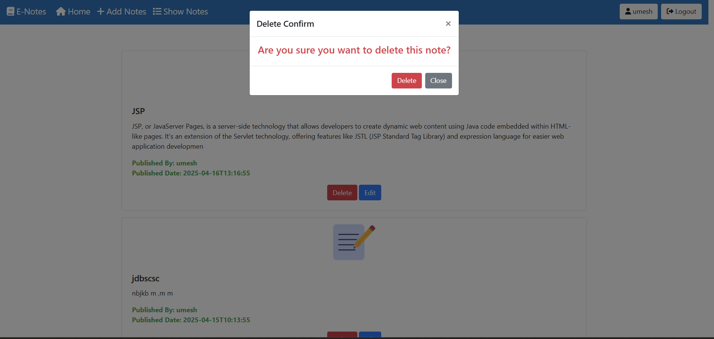

<<<<<<< HEAD
# E-Notes-Hub-WebApp
E-Notes is a web-based note-taking app that allows users to create, view, update, and delete personal notes securely. Built using JSP, Servlets, JPA, and JSTL, it offers user authentication and a clean interface. Notes are stored in a database, enabling users to manage content anytime, anywhere.
=======

# E-Notes-webapp
## Overview
E-Notes is a web application that allows users to take and save notes. Users can register for a new account, log in, and perform various operations 
such as creating, editing, viewing, and deleting notes.  (Screenshots below for more illustration)
## Technologies Used
- Java
- JSP (JavaServer Pages)
- Servlet
- MySQL
- JDBC (Java Database Connectivity)
- HTML
- CSS
- Bootstrap
- Tomcat (Local server)

## Getting Started
To run the E-Notes web application locally, follow these steps:  
**1. Database Setup:**
   - Set up a MySQL database and configure the connection details in your application.

**2. Run on Tomcat:**
   - Deploy the application on a local Tomcat server.
   - Build and run the project using your preferred IDE or build tools.

**3. Access the Application:**
   - Open a web browser and go to http://localhost:8080/.

## Project Structure
   - src/ : Contains Java source code.
   - web/ : Contains JSP, HTML, CSS, and other web resources.
   - sql/ : Includes SQL scripts for database setup.

## Features
   - **User Registration:** Create a new account using name, email and new password to access the application.
   - **User Authentication:** Login securely to your account and manage your notes.
   - **Note Operations:** You will be able to do many operations in this app like
       - Create new notes.
       - Edit existing notes.
       - View a list of notes.
       - Delete unwanted notes.
     
## Usage
1. Register an Account:
   - Access the application and register for a new account.
2. Log In:
   - Log in using your registered credentials.
3. Manage Notes:
   - Create, edit, show, and delete your notes.
   
## ScreenShots
<<<<<<< HEAD
=======

>>>>>>> 78cf791 (Updated README and added screenshots)

## Contributions
Contributions are welcome! If you find a bug or have suggestions for improvement, feel free to open an issue or create a pull request.

## License
This project is licensed under the MIT License.
>>>>>>> 0973cd5 (Initial commit for E-notes Project)
